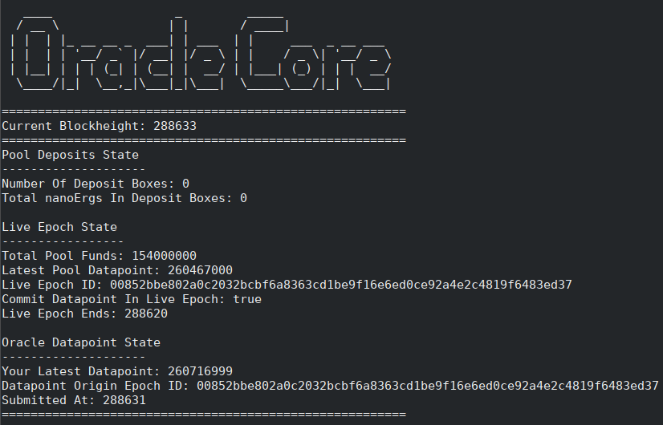

# Oracle Core

The oracle core is the off-chain component that oracles who are part of an oracle pool run. This oracle core provides a HTTP API interface for reading the current protocol state & another for submitting datapoints. Once a datapoint is submit the oracle core will automatically generate the required tx and post it as well as any other actions required for the protocol to run. This thereby allows the oracle to participate in the oracle pool protocol without any extra effort for the oracle operator.

The oracle core requires that the user has access to a full node wallet in order to create txs & perform UTXO-set scanning. Furthermore each oracle core is designed to work with only a single oracle pool. If an operator runs several oracles in several oracle pools then a single full node can be used, but several instances of oracle cores must be run (and set with different api ports).

A `connector` must also be used with the oracle core in order to acquire data to submit to the pool. Each connector sources data from the expected sources, potentially applies functions to said data, and then submits the data to the oracle core via HTTP API during the `Live Epoch` stage in the oracle pool protocol. All oracles for a given pool are expected to use the exact same connector, thereby making it simple to onboard and get started.

The current oracle core is built to run the protocol specified in the [Basic Oracle Pool Spec](https://github.com/ergoplatform/oracle-core/blob/master/docs/Basic-Oracle-Pool-Spec.md). Future versions will also support stake slashing and governance, with the specs already available for reading in the [docs folder](docs).

# Running An Oracle

1. Ensure your Ergo node is running with an unlocked wallet.
2. Edit the `oracle-config.yaml` to contain your oracle address (from the wallet), node config details, and all of the required parameters for your given oracle pool.
3. Launch the oracle core by running the executable `./oracle-core`.
4. Launch an oracle connector which fetches data and submit it to the oracle core automatically.
5. Use one of the API endpoints to check the status of your oracle.

# Bootstrapping An Oracle Pool

1. Generate a new NFT for your new Oracle Pool.
2. Generate a new "Oracle Pool Participant Token" of total count equal to the number of oracles who will be a part of the pool.
3. Decide on and set the key parameters of the pool which will be hard-coded into the contracts. (ie. Epoch Prep Length, Live Epoch Length, Payout Amount, etc.)
4. Compile the smart contracts using the parameters/token ids to acquire the smart contract/stage addresses.
5. Fill out a `oracle-config.yaml` with all of the parameters of the oracle pool which were set, as well as with the newly generated smart contract addresses.
6. Send the `oracle-config.yaml` to all of the oracles part of the pool.
7. Wait until all of the oracles launch the oracle core so that their nodes can register the proper UTXO-set scans.
8. Bootstrap the oracle pool box at the "Epoch Preparation" stage/contract, and holding the "Oracle Pool NFT".
9. Acquire the addresses of all of the oracles.
10. Bootstrap a "Datapoint" box for every single one of the oracles with their corresponding addresses held in R4, and with a single "Oracle Pool Participant Token".

### Oracle Pool Bootstrap Flow

1. Generate Pool NFT
2. Generate Participant Tokens
3. Get list of oracle addresses.
4. Set parameters in contracts.
5. Compile Contracts.
6. Register scans in node via oracle-cores for each oracle using compiled contract addresses.
7. Bootstrap "Epoch Prep" pool box.
8. Bootstrap oracle "Datapoint" boxes.